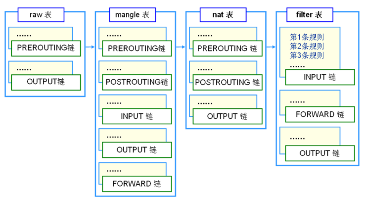
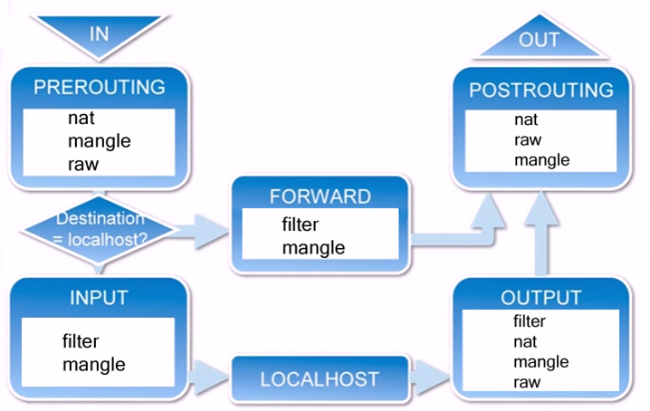

# CentOS7命令总结

## 开发环境

~~~shell
# root权限下，修改sudoers，添加用户权限
> chmod +w /etc/sudoers
> vi /etc/sudoers

# 镜像源替换为国内的源
> mv /etc/yum.repos.d/CentOS-Base.repo /etc/yum.repos.d/CentOS-Base.repo.backup

> wget -O /etc/yum.repos.d/CentOS-Base.repo http://mirrors.aliyun.com/repo/Centos-7.repo

# 如果没有wget命令，可使用curl
> curl -O http://mirrors.aliyun.com/repo/Centos-7.repo && mv Centos-7.repo /etc/yum.repos.d/CentOS-Base.repo

> yum clean all && yum makecache

# 设置网络，我开发环境采用了双网卡，1个网卡用于上网即NAT模式，另1个网卡用于虚拟机与主机互通
# NAT网卡
> chmod +w /etc/sysconfig/network-scripts/ifcfg-enp0s3
> cd /etc/sysconfig/network-scripts
> vi ifcfg-enp0s3 # 将 ONBOOT 修改为 yes
> chmod -w ifcfg-enp0s3

# host-only网卡，因为是后加的网卡，需要自己创建ifcfg-enp0s8文件
> cp ifcfg-enp0s3 ifcfg-enp0s8
# 将dhcp改为static，并添加ip
IPADDR=$ip
NETMASK=255.255.255.0
GATEWAY=192.168.56.1 # 如果你的网卡是其他ip，请修改
# 查看网卡的UUID
> nmcli con show

# 修改ifcfg-enp0s8的UUID（因为拷贝的enp0s3文件，其UUID与enp0s3一样）

# 可选操作：网卡重新生成UUID，$eth 指网卡名称
> uuidgen $eth

# 设置公钥免密登录，请预先生成公私钥
> sudo vi /etc/ssh/sshd_config

PubkeyAuthentication yes # 启用公钥认证

# 将公钥拷贝至服务器，并建立文件夹.ssh
> mkdir .ssh && mv your.pub .ssh && cd .ssh

# 如果已存在authorized_keys文件，请将公钥的内容拷贝出来，粘贴到该文件里
> mv your.pub authorized_keys # 这里仅表示重命名的方式

# 修改文件权限
> chmod 0700 .ssh && chmod 0600 .ssh/authorized_keys

# 重启sshd服务
> sudo systemctl restart sshd.service

# 扩展
> sudo systemctl status sshd.service
> sudo systemctl start/stop sshd.service
# 开机自启
> sudo systemctl enable sshd.service

# 宿主机在.ssh文件里创建config并配置
host $machinename
     	user $username
        hostname $ip
        port 22
        identityFile /path/privatekey
        
# 安装git
> sudo yum install -y git
# 安装zsh, oh-my-zsh
> sudo yum install -y zsh
> sh -c "$(curl -fsSL https://raw.githubusercontent.com/robbyrussell/oh-my-zsh/master/tools/install.sh)"
# 设置通配符匹配
> vi .zshrc
setopt nonomatch

# 安装网络工具
> sudo yum install -y wget net-tools nc vim

# 安装java8 maven，下载jdk maven，解压，这里仅记录设置环境变量
> vim .zshrc
export JAVA_HOME=/usr/local/java
export JRE_HOME=$JAVA_HOME/jre
export CLASSPATH=.:$JAVA_HOME/lib:$JRE_HOME/lib
export M2_HOME=/usr/local/maven
export PATH=$PATH:$JAVA_HOME/bin:$M2_HOME/bin
> source .zshrc
> mvn -v

# 安装docker
> yum remove docker docker-common docker-selinux docker-engine -y
> yum install -y yum-utils device-mapper-persistent-data lvm2
> yum-config-manager --add-repo http://mirrors.aliyun.com/docker-ce/linux/centos/docker-ce.repo
> yum makecache fast
> yum install docker-ce -y
> sudo usermod -aG docker $user
> sudo systemctl enable docker
> sudo systemctl start docker

# 配置公钥访问github
# 1. 生成公私钥对； 2. 将公钥添加到GitHub管理起来；3. .ssh/config文件添加以下内容
host github.com
        user git
        hostname github.com
        identityFile /path/your_private
        
# 安装mycli
> sudo yum install -y epel-release
> sudo yum install -y python-pip
> sudo pip install --upgrade pip
> sudo pip install mycli
# 安装过程中如果遇到
# It is a distutils installed project and thus we cannot accurately determine which files belong to it which would lead to only a partial uninstall.

# 这是因为旧版本依赖多，不能清晰的删除，此时应该忽略旧版本升级，即如下 

# 解决办法：sudo pip install xxx --ignore-installed xxx

# 然后重新安装mycli
> sudo pip install mycli

# 安装 dig
> sudo yum install -y bind-utils

# 安装the fuck
> sudo yum install -y gcc
> sudo yum install -y python3-devel python3-pip python3-setuptools
> sudo pip3 install thefuck

~~~

> [CentOS修改镜像源记录](https://blog.csdn.net/spark_csdn/article/details/80791429)

## 防火墙

* 查看已经开放的端口

  ~~~shell
  sudo firewall-cmd --list-port
  ~~~

* 开启端口

  ~~~shell
  # zone: 作用域
  # $port: 替换为具体的端口号，格式为：端口/通讯协议
  # permanent: 永久生效
  sudo firewall-cmd --zone=public --add-port=$port/tcp --permanent
  ~~~

* 重启防火墙

  ~~~shell
  # 重启
  sudo firewall-cmd --reload
  # 停止
  sudo systemctl stop firewalld.service
  # 禁止开机启动
  sudo systemctl disable firewalld.service
  ~~~

* 设置时间和时区

  ~~~shell
  # 安装ntp服务包
  sudo yum install ntp
  
  # 设置为开机启动
  sudo systemctl enable ntpd
  
  # 修改启动参数，增加`-g -x参数`,允许ntp服务器在系统时间误差较大时也能工作
  # OPTIONS="-g -x"
  sudo vi /etc/sysconfig/ntpd
  
  # 将系统时区改为上海时间
  sudo ln -sf /usr/share/zoneinfo/Asia/Shanghai /etc/localtime
  
  # 启动或重启ntp服务
  sudo service ntpd restart
  
  # 查看时间是否正确
  date
  ~~~

## 查看内核信息

~~~shell
# 查看全部信息
uname -a
# 查看内核信息
uname -r
# 查看Linux版本号
cat /etc/redhat-release
~~~

## 升级内核

~~~shell
# centos7内核是3.10.x，内核存在bug，导致docker、Kubernetes不稳定
# 升级至5.2.x
# step 1 update all packages to the latest version
sudo yum -y update
# install the following package to make installation and updating process fast
sudo yum -y install yum-plugin-fastestmirror

# step 2
cat /etc/redhat-release
cat /etc/os-release

# step 3, add ELRepo Repository
rpm --import https://www.elrepo.org/RPM-GPG-KEY-elrepo.org
rpm -Uvh http://www.elrepo.org/elrepo-release-7.0-2.el7.elrepo.noarch.rpm
yum repolist

# step 4, install kernel
yum --enablerepo=elrepo-kernel install kernel-ml

# step 5 Configure Grub2 CentOS 7
sudo awk -F\' '$1=="menuentry " {print i++ " : " $2}' /etc/grub2.cfg
sudo grub2-set-default 0
sudo grub2-mkconfig -o /boot/grub2/grub.cfg
sudo reboot

# step 6, check kernel
uname -msr

# step 7, remove old kernel(optional)
yum install yum-utils
package-cleanup --lodkernels
~~~

## Vim操作

~~~shell
# 列编辑
# 使用vim打开一个文件
1. normal模式下，按下Crtl+v，进入视图模式
2. 按 hjkl 选择需要列编辑的行与列位置
3. shift+i 或 shift+a (即大写的I或A)，进入编辑模式
4. 输入要插入的内容（此时看到的光标所在行输入）
5. 按Esc退出编辑模式，等1~2s即会看到列编辑完成。
~~~

## 安装expect

~~~shell
# 安装expect, 就可以写脚本登录
yum install -y expect
# demo: 登录腾讯云
# 可以将 bash -c后的语句换成 ssh，即可实现登录服务器
# 下面是脚本内容

#!/usr/bin/expect -f
set timeout 10
spawn bash -c "docker login --username=$name ccr.ccs.tencentyun.com"
expect {
  "*Password*" {send "$passwd\r"}
}
interact
~~~

[终端教程](http://wiki.linuxchina.net/index.php?title=CentOS7.x%E5%AE%89%E8%A3%85%E9%85%8D%E7%BD%AEShadowsocks%E5%AE%A2%E6%88%B7%E7%AB%AF%E7%BB%88%E7%AB%AF%E7%BF%BB%E5%A2%99)

## supervisor

### 1. 安装

~~~shell
# 第一种安装方式
> pip install supervisor

# 第二种安装方式
> yum install -y python-setuptools
> easy_install supervisor
~~~

### 2. 准备工作

~~~shell
# 创建 supervisord.conf
> touch /etc/supervisor/supervisord.conf
~~~

~~~conf
; supervisor config file

[unix_http_server]
file=/var/run/supervisor.sock   ; (the path to the socket file) UNIX socket 文件，supervisorctl 会使用
chmod=0700                       ; sockef file mode (default 0700) socket 文件的 mode，默认是 0700

[supervisord]
logfile=/var/log/supervisor/supervisord.log ; (main log file;default $CWD/supervisord.log) 日志文件，默认是 $CWD/supervisord.log
pidfile=/var/run/supervisord.pid ; (supervisord pidfile;default supervisord.pid) pid 文件
childlogdir=/var/log/supervisor            ; ('AUTO' child log dir, default $TEMP)

; the below section must remain in the config file for RPC
; (supervisorctl/web interface) to work, additional interfaces may be
; added by defining them in separate rpcinterface: sections
[rpcinterface:supervisor]
supervisor.rpcinterface_factory = supervisor.rpcinterface:make_main_rpcinterface

[supervisorctl]
serverurl=unix:///var/run/supervisor.sock ; use a unix:// URL  for a unix socket 通过 UNIX socket 连接 supervisord，路径与 unix_http_server 部分的 file 一致

; 在增添需要管理的进程的配置文件时，推荐写到 `/etc/supervisor/conf.d/` 目录下，所以 `include` 项，就需要像如下配置。
; 包含其他的配置文件
[include]
files = /etc/supervisor/conf.d/*.conf ; 引入 `/etc/supervisor/conf.d/` 下的 `.conf` 文件
~~~

在`supervisord.conf`下，`;`代表注释。

进入到`/lib/systemd/system`，创建文件 `supervisord.service`，内容如下

~~~
[Unit]
Description=Supervisor process control system for UNIX
Documentation=http://supervisord.org
After=network.target

[Service]
Type=forking
ExecStart=/usr/bin/supervisord -c /etc/supervisor/supervisord.conf
ExecReload=/usr/bin/supervisorctl -c /etc/supervisor/supervisord.conf $OPTIONS reload
ExecStop=/usr/bin/supervisorctl $OPTIONS shutdown
KillMode=process
Restart=on-failure
RestartSec=50s

[Install]
WantedBy=multi-user.target
~~~

注意这里 `[Service]`下的第一行，如果不加，supervisor启动后就会自动退出。

~~~shell
# 创建目录
> mkdir -p /etc/supervisor/conf.d

# 在该目录下添加配置文件，即配置你的应用程序，交由supervisor托管
# 我这里以filebeat.conf为例
> touch filebeat.conf
# 在该文件下写入以下内容，具体配置请自行搜索
[program:filebeat]
command=/opt/filebeat/filebeat -c /opt/filebeat/filebeat.yml -e
user=root
stdout_logfile=/opt/filebeat/logs/test.out
autostart=true
autorestart=true
startsecs=5
priority=1
stopasgroup=true
killasgroup=true
~~~

### 3. 设置开机启动

~~~shell
# 开机启动
> systemctl enable supervisord

# 查看状态
> systemctl status supervisord

# 启动/停止/重启
> systemctl start/stop/restart supervisord

# 上面提到的 supervisord.service 服务文件，如果有修改，执行下面指令
> systemctl daemon-reload

# 查看开机启动项
> systemctl list-unit-files | grep enable
~~~

启动后，就可以用`supervisorctl`管理应用。

> [supervisord]([http://supervisord.org](http://supervisord.org/))

## 查找大文件

~~~shell
> find / -type f -size +800M  -print0 | xargs -0 du -h
~~~

## iptables

### 规则

规则：网络管理员预定义的条件。

一般定义：如果数据包头符合这样的条件，就这样处理该数据包。

存储：内核空间的信息包过滤表中。

规则包含：

* 源地址
* 目的地址
* 传输协议（TCP、UDP）
* 服务类型（HTTP、FTP）
* ...等

当数据包与规则匹配时，iptables根据规则定义的方法处理数据包。如：`accept`、`reject`、`drop`等。

### 表

iptables内置以下4个表，用于实现包过滤，网络地址转换和包重构的功能。优先级： `raw -> mangle -> nat-> filter`。

- raw：仅作用进（PREROUTING）和出（OUTPUT ）的链。优先级最高，可对数据包在链接跟踪前处理。RAW处理后，将跳过NAT表和ip_conntrack处理，即不做地址转换和数据包的链接跟踪处理。
- mangle：用于对指定数据包进行更改。
- nat：用于网络地址转换NAT，可实现一对一、一对多、多对多等NAT工作。iptables使用该表实现共享上网。
- filter：用于过滤数据包。根据管理员预定义的一组规则过滤符合条件的数据包。对于防火墙，主要是在filter表中指定规则实现数据包过滤。这是**默认**的表，如果没有指定哪个表，iptables默认使用filter表执行所有命令。只允许对数据包进行 `accept` 、`drop`操作，无法更改数据包。

### 链

* PREROUTING
* INPUT
* FORWARD
* OUTPUT
* POSTROUTING

1. 数据包进入网卡，首先进入到`PREROUTING`链，内核根据数据包的目的IP判断是否需要转发出去
2. 数据包如果是进入本机的，则会连着图向下移动，到达`INPUT`链。
   1. 数据包到了INPUT链，任何进程都会收到它。（摘录）
   2. 本机运行的程序可以发送数据包，发送的数据包经过`OUTPUT`链，到达`POSTROUTING`出去。
3. 数据包如果是需要转发出去，且内核允许转发，数据包向右移动，经过`FORWARD`链，然后到达`POSTROUTING`链出去。
   * `cat /proc/sys/net/ipv4/ip_forward`输出为1，则代表内核允许转发。
   * 可在`/etc/sysctl.conf`里配置 `net.ipv4.ip_forward = 1`，然后执行`sysctl -p`

链，是数据包的传输路径。每条链是众多规则的检查清单，每条链中可以有一条或数条规则。

1. 当数据包到达一条链时，iptables会从链中的第一条规则开始检查，看数据包是否满足规则所定义的条件。

2. 如果满足，系统就会根据该条规则所定义的方法处理该数据包。
3. 否则，将继续检查吓一跳规则
4. 如果不符合链中的任一条规则，iptables就会根据该链预先定义的默认策略处理该数据包。

## jq

jq是基于命令行的`JSON`字符串处理工具。功能：

* 不同的方式转换`JSON`。
* 接受文本输入。
* 从stdin读取，与管道组合可以方便的处理`JSON`。

格式化JSON、压缩JSON等功能。

## Linux快速清空文件内容

~~~shell
# 以下是几种常用的方法
# : 为占位符
$ : > filename
$ > filename
$ echo "" > filename
$ echo /dev/null > filename
$ echo > filename
$ cat /dev/null > filename
$ cp /dev/null filename
~~~

