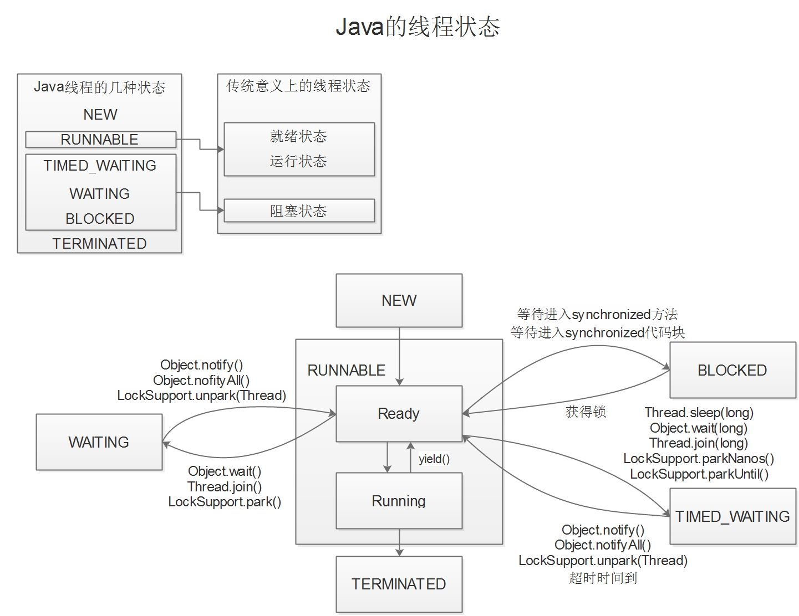
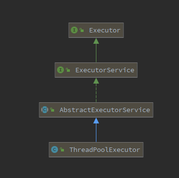
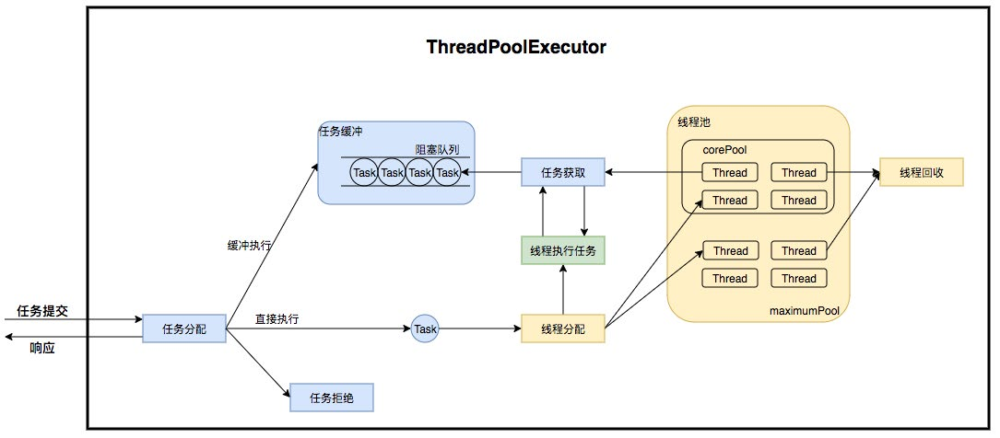
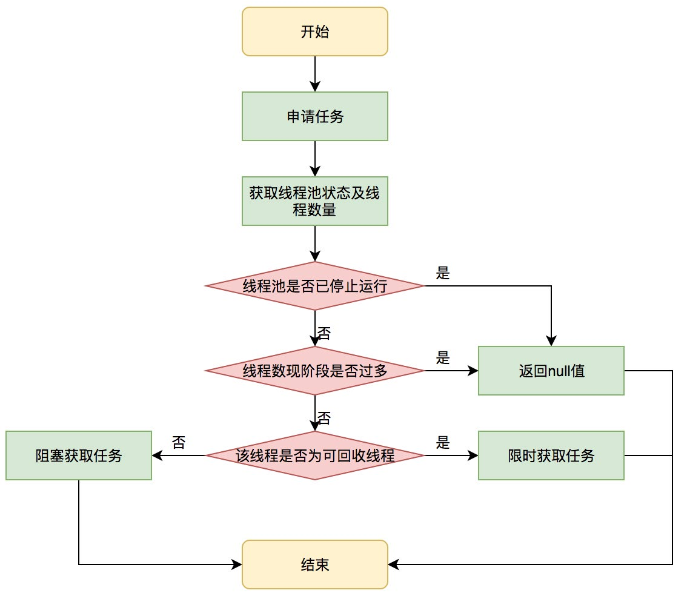
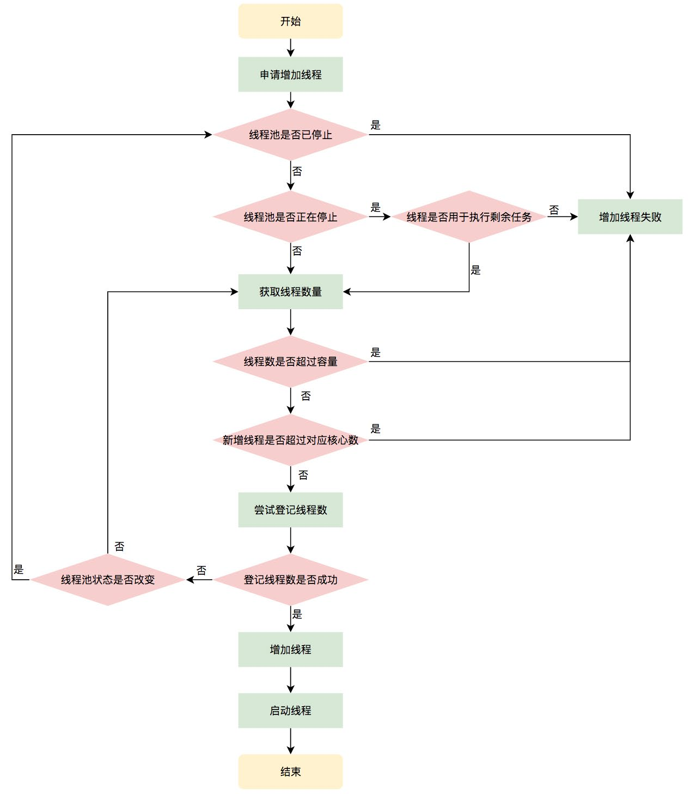
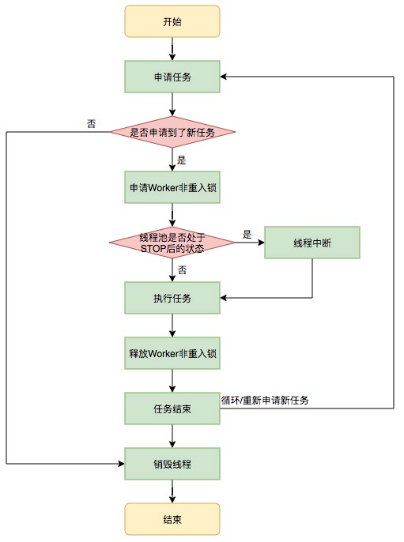
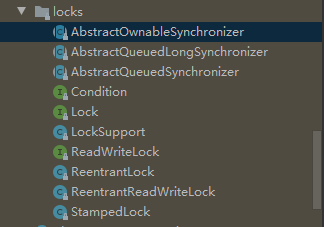
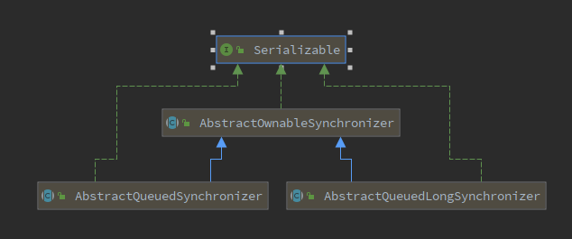
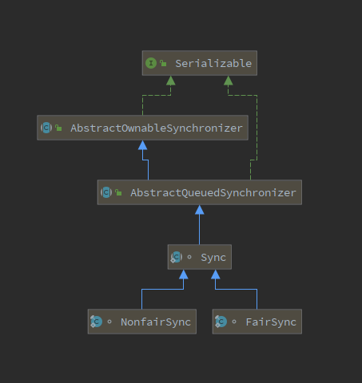

# Java基础+多线程

## 1. 字符串

Java中字符串的存储，是在堆空间中。根据创建方式不一样，在堆中存储的地方也是不一样的。

~~~java
// 创建方式1：
// 存储在常量池中。会先在常量池中查找，如果没有，则创建，如果有，则返回
String a = "abc";

// 创建方式2：
// 存储在普调对象区域，调用String.intern()可将其添加到常量池中
String b = new String("abc")
~~~

>  `StringBuffer`与`StringBuilder`


掌握并熟练使用API

推荐阅读

*  [Guava String扩展包](https://github.com/google/guava/wiki/StringsExplained)
* 一些常用的`StringUtils`工具类，比如Apache common库中的

扩展，字符串相关算法

1. KMP算法
2. 编辑距离

问题：

1. 两个字符串的数字相加求和
2. 

## 2. 集合与泛型

在Java中，我们用的最多的集合就是List、Set、Map三种类型了。如图，是集合的全景图。


* 黄色虚线框的是接口

* 黄色实线框的是类
* Produces：代表产生，比如Map可以生成Collection

最常用的三个类型为`ArrayList`、`HashSet`、`HashMap`。


## 3. 多线程

什么是线程（Thread），什么是进程（process）？

线程：是操作系统能够进行运算调度的最小单位，包含在进程中，是进程中实际运作单位。

进程：是计算机中关于某种数据集合上的一次运行活动，是系统进行资源分配和调度的基本单位。


Java语言，是支持多线程的。

一个Java程序本质上是一个JVM进程，JVM进程使用一个**主线程**来执行`main()`方法，在`main()`方法中，我们又可以启动多个线程。

> JVM中还会有其他的工作线程，比如垃圾回收的线程。


并行与并发

* 并行：多个CPU实例或多台机器同时执行一段处理逻辑，真正的同时
* 并发：通过CPU调度算法，让看上去同时执行，实际从CPU角度上看并不是同时的。

线程安全与线程不安全

* 线程安全：一段代码，经过多线程执行，线程调度顺序不影响结果。
* 线程不安全：则是线程调度顺序会影响到最终结果。

同步：人为的控制和调度，保证共享资源在多线程的访问下成为线程安全，以此保证结果的准确。

###### 如何实现线程安全？

1. 加锁，使用 synchronized 或 lock
2. Atomic原子类
3. 信号量
4. 不可变对象

### 1. 创建线程

* 继承Thread类
* 实现Runnable
* 实现Callable

### 2. 线程状态

线程总共有6种状态，从Thread的源码，字段`threadStatus`代表线程状态，我们可以看到一个State的枚举

~~~java
public enum State {
    NEW, RUNNABLE, BLOCKED, WAITING, TIMED_WAITING, TERMINATED;
}
~~~

* NEW：创建了一个线程对象，但未执行
* RUNNABLE：在Java虚拟机中执行
* BLOCKED：线程阻塞，等待锁
* WAITING：等待其他线程做出一些动作（通知或中断）
* TIMED_WAITING：等待其他线程做出一些动作（通知或中断），无动作的话但会在指定时间后自动返回。
* TERMINATED：代表线程执行完成

线程状态之间的切换



线程状态变更路线：

* 新 —— 可运行 —— 终止
* 新 —— 可运行 —— 阻塞 —— 可运行 —— 终止
* 新 —— 可运行 —— 等待 —— 可运行 —— 终止
* 新 —— 可运行 —— 计时等待 —— 可运行 —— 终止


线程其他重要的属性：

1. 线程名称
2. 是否是守护线程
3. 线程优先级

线程是一种昂贵的资源，如果频繁的创建、销毁线程是很不明智的。线程数量过多，也会带来额外的开销，如线程调度。

### 3. 线程池

线程池解决的核心问题：资源管理的问题。线程池，池化的思想：为了最大收益+最小风险，将资源统一管理的思想。

#### 线程池的优点

* 降低资源消耗，减少线程创建与销毁的消耗
* 提高响应速度，任务到达时无需等待线程创建即可执行
* 提高线程的可管理性，稀缺的线程资源，不能无限制的创建，使用线程池还能统一分配、调优和监控。

##### 线程池的设计

说起Java的线程池，通常是指`ThreadPoolExecutor`类。



这是`ThreadPoolExecutor`的UML图，顶层实现了`Executor`接口。`Executor`接口的描述中，有如下这句形容：

~~~html
This interface provides a way of decoupling task submission from the  mechanics of how each task will be run, including details of thread  use, scheduling, etc. 
~~~

这句话的意思就是，这个接口解耦了**任务提交**与**任务运行**。

这个接口里，其实只有一个方法`execute(Runnable command)`。

`ExecutorService`接口继承了`Executor`，这是一个更广泛的接口，其作用：

1. 提供终止线程池的管理方法
2. 产生`Future`对象追踪异步任务

`AbstractExecutorService`抽象类，提供了`ExecutorService`的默认实现。

接下来重点`ThreadPoolExecutor`，其运行机制



线程池内部实际上是一个**生产者消费者模型**，将**线程**与**任务**两者解耦。如图，可分为两部分

* 任务管理（蓝色部分）：充当生产者
* 线程管理（黄色部分）：充当消费者

##### 任务调度机制

通常，初学者必须掌握它的构造函数，通常，我们知道是有如下7个参数

* corePoolSize：核心线程数
* maximunPoolSize：最大线程数
* keepAliveTime：超过核心数的线程空闲等待最长时间
* timeunit：时间单位，和keepAliveTime结合使用
* workQueue：用来持有未执行的任务的工作队列
* threadFactory：线程工厂
* RejectedExecutionHandler：拒绝策略

整个线程池的工作流程：


任务提交到线程池中，

1. 如果当前线程数量小于核心数，则会创建新线程执行任务；

2. 如果当前线程等于核心数，则会判断阻塞队列是否已满；

3. 阻塞队列未满，添加到队列中；
4. 阻塞队列已满，则判断当前线程数是否大于最大线程数；
5. 阻塞队列已满，如果当前线程小于最大线程数，则创建新线程执行任务；
6. 阻塞队列已满，如果当前线程等于最大线程数，则拒绝任务。

> 思考：为什么当前线程达到核心数后，任务会进入到队列中，而不是继续创建线程（假设max>core）处理，为什么要这样设计？

##### 生命周期

线程池的状态


* RUNNING：接受新任务和处理队列中的任务
* SHUTDOWN：不接受新任务，但处理队列中的任务
* STOP：不接受新任务，不处理队列中的任务，并且中断处理中的任务
* TIDYING：所有任务都被终止，工作线程数量为0，线程过渡到此状态将会运行`terminated()` 方法
* TERMINATED：`terminated()` 执行完成

线程池中，是如何保存线程状态以及工作线程数量的呢？

答：是用`AtomicInteger`类型的1个变量`ctl`同时存储线程工作状态及工作线程数量。int是32位的，高3位用于表示状态，低29位表示工作线程数量。

#### 任务

##### 任务缓冲

回想刚才的运行机制，我们说过线程池内部是一个**生产者与消费者模型**，对任务与线程管理。从前面的构造参数，我们也可以知道，任务与线程二者是没有直接关联的。他们直接是通过**阻塞队列**关联起来的。

任务提交到线程池中，进阻塞队列（假设核心线程都在工作且队列未满的情况），这是生产者。

而工作线程，从阻塞队列中取任务，并执行。

> 阻塞队列的特性不讲，自己去学习。

##### 任务申请

任务提交到线程池后，执行存在2种情况

1. 任务直接有新创建的线程执行
2. 任务进入到阻塞队列，由线程从阻塞队列中获取并执行

我们知道，第一种仅出现在线程初始创建的时候，第二种才是线程获取任务的绝大多数情况。

线程获取执行任务的流程如下，源码的私有方法`getTask()`实现此流程策略。



##### 任务拒绝

任务拒绝属于线程池的保护部分。超出线程池的处理能力，直接拒绝处理。线程池的最大容量为，任务的缓冲队列已满并且线程池的线程数目达到`maximumPoolSize`大小。其含有多种拒绝策略，请自行学习。

#### 工作线程

`Worker`是线程池中的内部类，继承`AbstractQueuedSynchronizer`实现独占锁，实现Runnable，持有一个线程，一个运行任务firstTask。

~~~java
private final class Worker
        extends AbstractQueuedSynchronizer
        implements Runnable
    {
        /** Thread this worker is running in.  Null if factory fails. */
        final Thread thread;
        /** Initial task to run.  Possibly null. */
        Runnable firstTask;
    	...
    }
~~~

如果`firstTask`不为空，则先执行`firstTask`，然后再从阻塞队列中获取任务（`getTask`）执行。

如果`firstTask`为空，则直接从阻塞队列中获取任务（`getTask`）执行。

使用独占锁，为的就是实现不可重入的特性去反应线程现在的执行状态。

在线程池中，通过一个哈希表存储工作线程了的引用。

```java
/** 
  * Set containing all worker threads in pool. Accessed only when 
  * holding mainLock. 
  */
private final HashSet<Worker> workers = new HashSet<>();
```

##### 增加线程

`addWorker(Runnable firstTask, boolean core)`



##### 线程执行任务

Worker线程中run方法执行 `runWorker(Worker w)`，执行过程如下：

1. while循环不断的通过`getTask`从阻塞队列获取任务。
2. 如果线程池正在停止，则要保证当前线程为中断状态；否则要保证当前线程不是中断状态。
3. 执行任务。
4. 如果`getTask`为空，则跳出循环，执行`processWorkerExit()`方法，销毁线程。



##### 回收线程

线程池中的线程销毁依赖JVM自动回收，线程池做的工作是，根据当前线程池的状态维护一定数量的线程引用，防止这部分线程被JVM回收。当决定需要回收哪些线程，只需将其引用消除即可。

核心线程可以无限等待获取任务，非核心线程需要限时等待获取任务。

> 这句如何理解呢？在前面线程执行时，我们说到，通过不断的while循环获取任务，当获取到任务为`null`，即退出。那么核心线程是如何无限等待获取任务呢？（前提是`allCoreThreadTimeOut`为`false`）
>
> 我们再次返回看`getTask`方法，有这么一段声明：
>
> Performs blocking or timed wait for a task，depending on current configuration settings, or returns null if this worker must exit because of any of:
>
> 1. There are more than maximunPoolSize workers
> 2. The pool is stopped.
> 3. The pool is shutdown and the queue is empty
> 4. This worker timed out waiting for a task, and timed-out workers are subject to termination (that is, allowCoreThreadTimeOut || workerCount > corePoolSize) both before and after the timed wait, and if the queue is non-empty, this worker is not the last thread in the pool.
>
> 查看源码，会知道，只要是核心线程，在从阻塞队列中获取任务，获取不到时，会阻塞住。
>
> 即`workQueue.take()`行。

事实上，在`processWorkerExit()`方法中，将线程引用移出线程池就已经结束了线程销毁的部分。

但由于引起线程销毁的可能性有很多，线程池还要判断是什么引发了这次销毁，是否要改变线程池的现阶段状态，是否要根据新状态，重新分配线程。

##### 线程池的拒绝策略

* CallerRunsPolicy：调用线程执行策略
* AbortPolicy：拒绝策略，抛出异常
* DiscardPolicy：丢弃策略，静默丢弃
* DiscardOldestPolicy：丢弃最老任务，然后重新提交到线程池中（execute）

#### 实用小技巧

在使用中，应当实现线程工厂，并命名线程池。

命名线程池的优点：

* 便于查看日志
* 便于进行JVM分析

###### 动态线程池

方法：`setCorePoolSize()`与`setMaximumPoolSize()`

###### 预热

方法：`preStartCoreThread()` 、 `ensurePrestart()` 、`prestartAllCoreThreads()`

> 推荐阅读美团技术文章，线程池

### 4. 锁

关键字`synchronized`、`Lock`。

#### synchronized

synchronized获取的对象锁，分为两种情况讨论：

1. 实例对象
2. 类

##### 获取实例对象的锁

类的一个实例，都有一个对象锁。同一个类的，不同实例是具有不同的锁。

当不同的线程分别操作不同的实例，执行同一段被synchronized关键字形容的代码，是互不影响的。

##### 获取类的锁

每个类都有自己的锁，不同的线程获取同一个类的锁，此时未获得到锁的线程是需要等待的。

作用区域，分为两种情况讨论：

1. 方法上：又可分为静态方法与实例方法
2. 方法内

作用在方法上：如果是静态方法，那么和获取类的锁一致。如果是实例方法，那么和获取实例对象锁一致。

作用在方法内：具体是需要看锁定的是实例对象，还是类对象。

##### 缺陷

* 效率低：锁释放情况少，仅代码执行完成释放。试图获取锁，无法设置超时；不能中断正在使用锁的线程。
* 不够灵活：加锁与释放时机单一，每个锁仅有一个单一条件，不如读写锁灵活。
* 无法知道是否成功锁定：相对而言Lock可以拿到状态

#### Locks

J.U.C的locks包中有`ReentrantLock`、`ReentantReadWriteLock`、`StampedLock`（JDK8新增）等锁的类，我们先来看一下整个包的结构。



接口有3个，分别是

* Condition：线程间协作的条件，替换Object的`notify`、`notifyAll`、`wait`
* Lock：锁接口，其实现类为`ReentrantLock`
* ReadWriteLock：读写锁接口，其实现类为`ReentantReadWriteLock`

抽象类之间的关系



`AQS`与`AQLS`本质是一样的，唯一的不同在于，表示`synchronization state`的`state`字段，在AQS中是`int`型，在`AQLS`中是`long`型。

在`ReentrantLock`源码中，存在抽象类`Sync`继承`AQS`，内部实现`NonfairSync`、`FairSync`继承`Sync`。



> 注意`Sync`、`NonfairSync`、`FairSync`都是在`ReentrantLock`类中。

我们看`ReentrantLock`源码，可以知道本质实现都是在`AQS`中。那么，`AQS`到底是什么呢？

`AQS`，翻译过来叫抽象队列同步器。抽象代表它是一个抽象类，重点是后面的队列同步器。

同步器英文为`synchronizer`，我们之前学习过`synchronized`，那么同步器的意思也就很明显了。其在JavaDoc中的描述是“依赖于先进先出等待队列，提供一个框架实现阻塞锁和关联的同步器（如Semaphore、events等。）”

> 同步工具ReentrantLock、Semaphore、CountDownLatch、ReentrantReadWriteLock都使用了AQS。

`AQS`支持独占模式或共享模式，我们可以继承它去实现自己的同步器。

核心思想：

如果被请求的共享资源空闲，则将当前请求的线程设置为有效的工作线程，并将共享资源设置为锁定状态。

如果被请求的共享资源被占用，那么就需要有一种机制，实现线程阻塞等待以及被唤醒。`AQS`这个机制是用`CLH (Craig,Landin,and Hagersten)`队列锁实现的，即将暂时获取不到锁的线程加入到队列中。

~~~java
/**
  * The synchronization state.
  */
private volatile int state;
~~~


#### 原子类

`volatile`关键字作用：修改对其他线程可见。

CAS原理：CAS顾名思义，compare-and-swap，这是基于硬件实现的原子指令。

CAS操作需要输入2个数值，一个是旧值（操作前的期望值）和一个新的值。在操作期间，先比较旧值与内存实际值有没有变化，没有变化才替换成新值，发生了变化，则不交换。

CAS方式为乐观锁。synchronized与lock则是悲观锁。

CAS的问题

* ABA问题
* 循环时间长开销大
* 只能保证一个共享变量的原子操作

### 5. 线程模型


### 6. 异步编程


## 7. 注解与反射

## 8. 网络编程


## 9. JVM

