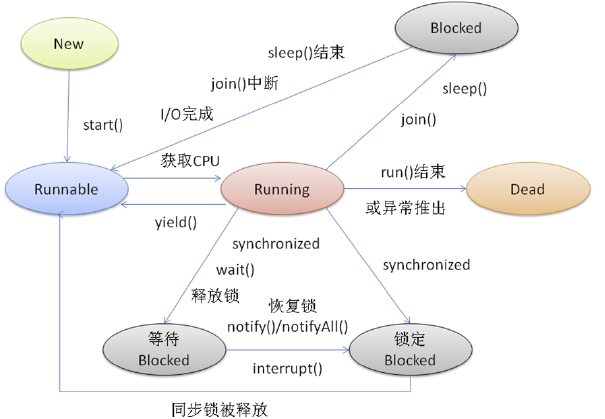
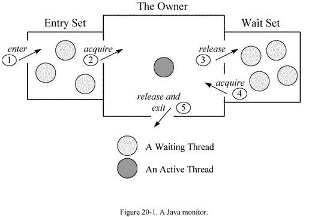
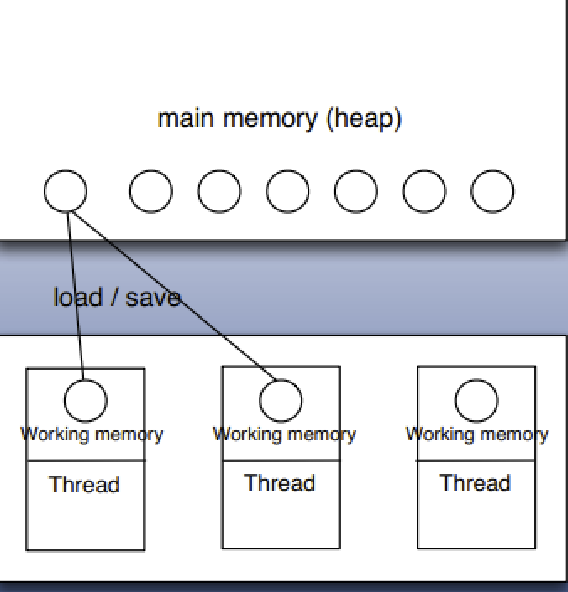

# Java

## 1. 集合


Java中，集合是存储对象最常用的一种方式。学习和熟练使用集合，对开发工作有事半功倍的效果。集合主要分三种类型，分别是List、Map以及Set。

> 数组虽然也可以存储对象，但数组长度固定；集合的长度是可变的。数组可以存储基本类型，但集合只能存储对象。

### List

特点：有序集合，可以存放重复的内容。常用的有两种实现：

* ArrayList：底层是数组，可随机访问，查找方便。
* LinkedList：底层是双向链表，增删方便，查找慢。

以上两种实现，根据其底层使用的数据结构，均有自己的特点。

可以用LinkedList实现LRU算法。

#### 常见问题

1. ArrayList里移除元素，可使用Iterator的remove，不可以使用list remove方法。

### Map

特点：Key-Value键值对。常用实现：

* HashMap:无序键值对，底层是数组+链表。
* LinkedHashMap:有序的，键值对，底层是双向链表
* TreeMap:有序的，底层是红黑树
* ConcurrentHashMap:JDK1.7使用分段锁，1.8使用CAS+synchronized实现

### Set

无序集合。不允许重复。常用实现：

* HashSet:底层实际上使用的是HashMap，存入的值是一个虚拟值。
* TreeSet:底层实际上是基于TreeMap的实现
* LinkedHashSet:

## 2. 多线程

什么是多线程？一个进程中，存在多个线程，并发的执行任务。多线程的目的就是为了更好的利用CPU资源。

并行与并发

* 并行：多个CPU实例或者多台机器同时执行一段处理逻辑，是真正的同时。
* 并发：通过CPU调度算法，让看上去是同时执行，实际从CPU的角度看并不是同时。并发往往在场景中有公用的资源，那么针对公用资源往往产生瓶颈。常用TPS和QPS来反应这个系统的处理能力。


* 线程安全：一段代码，经过多线程使用，线程调度顺序不影响结果。线程不安全，则是线程的调度顺序会影响最终结果。
* 同步：通过人为的控制和调度，保证共享资源在多线程访问下成为线程安全，以此保证结果的准确。

### 线程的状态



### wait、notify、notifyAll



synchronized, wait, notify 是任何对象都具有的同步工具。

wait、notify、notifyAll必须存在与synchronized块中，并且它们针对的是同一个监视器。

### synchronized

* 代码块：获取对象实例的monitor，如果实例相同，那么只有一个线程能执行。
* 直接作用于方法
  * 静态方法：锁定该类的monitor，不同的对象得进行同步。
  * 动态方法：锁定的是该类对象的monitor，不同的对象不影响。

#### volatile

多线程的内存模型：main memory（主存）、working memory（线程栈），在处理数据时，线程会把值从主存load到本地栈，完成操作后再save回去(volatile关键词的作用：每次针对该变量的操作都激发一次load and save)。



volatile还有另一个作用是禁止指令重排序。

针对多线程使用的变量如果不是volatile或者final修饰的，很有可能产生不可预知的结果（另一个线程修改了这个值，但是之后在某线程看到的是修改之前的值）。其实道理上讲同一实例的同一属性本身只有一个副本。但是多线程是会缓存值的，本质上，volatile就是不去缓存，直接取值。在线程安全的情况下加volatile会牺牲性能。

#### 线程类

* Thread类
* Runnable接口
* Callable接口

#### concurrent

##### ThreadLocal

##### 原子类

##### Lock

##### 容器类

##### 管理类

##### fork-join模型

##### 如何实现一个线程池

## 3. JVM

### Java内存区域

* 程序计数器：小块内存空间，当前线程所执行字节码的行号指示器。
* Java虚拟机栈：线程私有，生命周期与线程相同。
* 本地方法栈：为虚拟机使用到的native方法服务。
* Java堆：所有线程共享的内存区域，虚拟机启动时创建。
* 方法区：各个线程共享的内存区域。存储已被虚拟机加载的类信息、常量、静态变量、即时编译器编译后的代码等数据。
* 运行时常量池：方法区的一部分。
* 直接内存：并不是虚拟机运行时数据区的一部分。JDK1.4加入NIO，它可以是使用native函数库直接分配对外内存。

### 对象是否已死

* 引用计数法
* 可达性分析：可做gc roots对象
  * 虚拟机栈
  * 方法区类静态属性引用的对象
  * 方法区常量引用的对象
  * 本地方法栈JNI引用的对象

### 垃圾回收算法

* 标记-清除法
* 复制算法
* 标记-整理算法
* 分代收集算法

### 双亲委派模型


### Java内存模型


## 4. IO&NIO

## 5. 反射

#### 原理

Java反射机制是指在运行状态中，对于任意的一个类，都能够获取到这个类的所有属性和方法；对于任意一个对象，都能够调用它的任意一个方法和属性。这种动态获取信息以及动态调用对象的方法功能，就是Java的反射。

##### 获取Class方式

###### 1. Object类的getClass方法

```Java
// obj代表，代表一个类的对象
Class clz = obj.getClass()
```

###### 2.  静态class属性

```Java 
// Clazz代表任意一个类，
Class clz = Clazz.class
```

###### 3. forName方法

```Java
// forName方法，必须跟真实的带包名的类
try {
  Class clz = Class.forName("com.weiyiysw.Class");
} catch(ClassNotFoundException e) {
  e.printStackTrace();
}
```

总结：常用第三种方法。第一种方法，有对象了，获取类有点多余。第二种，必须导入包。第三种，传入一个字符串即可使用。

#### 使用

可以通过Class对象获取某个类的以下内容：

- 构造方法
- 成员变量
- 成员方法
- 访问成员

批量的方法： 

```Java
//所有”公有的”构造方法  
public Constructor[] getConstructors()
 
//获取所有的构造方法(包括私有、受保护、默认、公有) 
public Constructor[] getDeclaredConstructors() 
```

获取单个的方法，并调用： 

```Java
//获取单个的”公有的”构造方法
public Constructor getConstructor(Class… parameterTypes) 

//获取”某个构造方法”可以是私有的，或受保护、默认、公有； 
public Constructor getDeclaredConstructor(Class… parameterTypes)
```

 调用构造方法： 

```Java
 Constructor–>newInstance(Object… initargs) 
```

获取成员变量并调用： 

 批量的 

```java
// 获取所有的”公有字段” 
Field[] getFields()

// 获取所有字段，包括：私有、受保护、默认、公有；
Field[] getDeclaredFields()
```

获取单个的： 

```Java
// 获取某个”公有的”字段； 
public Field getField(String fieldName)

// 获取某个字段(可以是私有的) 
public Field getDeclaredField(String fieldName)
```

设置字段的值： 

```Java
// 参数说明： 
// obj:要设置的字段所在的对象； 
// value:要为字段设置的值；
Field –> public void set(Object obj,Object value)
```

 获取成员方法并调用： 

批量的： 

```Java
// 获取所有”公有方法”；（包含了父类的方法也包含Object类） 
public Method[] getMethods()
// 获取所有的成员方法，包括私有的(不包括继承的)
public Method[] getDeclaredMethods() 
```

获取单个的：

```Java
public Method getMethod(String name,Class<?>… parameterTypes): 
// 参数
// name : 方法名
// Class … : 形参的Class类型对象 
public Method getDeclaredMethod(String name,Class<?>… parameterTypes) 

```

调用方法： 

```Java
// 参数说明： 
// obj : 要调用方法的对象； 
// args:调用方式时所传递的实参；
Method –> public Object invoke(Object obj,Object… args): 
```

### 代理

#### 1. 静态代理

需要代理对象实现和目标对象一样的接口。

优点：不修改目标对象的前提扩展目标对象

缺点：冗余、不易维护

#### 2. 动态代理

利用了JDK API，动态的在内存中构建代理对象，从而实现对目标对象的代理功能。

动态代理对象不需要实现接口，但是目标对象必须实现接口。

动态代理本质是利用Java反射的能力，获取目标对象的类说明，通过类说明动态生成代理对象，由代理对象执行方法。

Java动态代理机制里，`proxy`类和`InvocationHandler`接口是实现动态代理的核心。

以下这段英文摘要是`InvocationHandler`的接口声明。代理接口实例需要实现`InvocationHandler`接口。

~~~java
/**
 * InvocationHandler is the interface implemented by
 * the invocation handler of a proxy instance.
 *
 * Each proxy instance has an associated invocation handler.
 * When a method is invoked on a proxy instance, the method
 * invocation is encoded and dispatch to the invoke method
 * of its invocation hander.
 *
 */
~~~

每个代理实例都关联了一个`InvocationHandler`。当代理对象执行调用方法时，这个方法调用会重编码和分发到实现`InvocationHandler`的`invoke`方法。

#### 3. cglib代理

通过第三方代码类库，运行时在内存中动态生成一个**子类**对象，从而实现目标对象功能的扩展。

Spring AOP使用此代理实现。此方法，会继承目标对象，所以需要重写方法。同时目标类，不能为final类。

## 6. 框架

### 1. Spring系列

#### Spring循环依赖

在Spring里，是由容器去创建对象，也就是通常所说的IOC。循环依赖是指，对象间相互依赖形成了环。比如，对象A依赖对象B，对象B依赖对象C，对象C依赖对象A，这样就构成了一个循环依赖。

循环依赖可以分为以下几种：

* 构造函数参数循环依赖：无法解决
* setter循环依赖
  * 单例模式：可解决
  * 非单例模式：无法解决

spring单例对象初始化的过程，大致可分为三步：

1. createBeanInstance：实例化bean，调用构造方法
2. populateBean：填充属性，主要对bean的属性进行填充
3. initializeBean：调用spring xml里配置的init方法，或者注解@PostConstruct声明的方法。

从单例bean的初始化的过程，可知，循环依赖是发生在第一步和第二步。

##### 构造器循环依赖

`this.singletonsCurrentlyInCreation.add(beanName)`将当前正要创建的bean记录在缓存中。Spring容器会将每一个正在创建的bean的标识符放到"当前创建bean池"，bean标识符在创建的过程中将一直保持在这个池中。因此，如果在创建bean的过程中发现自己已经在"当前创建bean池"里，则会抛出BeanCurrentlyInCreationException异常表示循环依赖。如果bean创建完成，那么将会从"当前创建bean池"移除。

##### setter单例循环依赖

Spring为解决单例循环依赖问题，使用了三级缓存。

~~~Java
/** Cache of singleton objects: bean name –> bean instance */
private final Map singletonObjects = new ConcurrentHashMap(256);
/** Cache of singleton factories: bean name –> ObjectFactory */
private final Map> singletonFactories = new HashMap>(16);
/** Cache of early singleton objects: bean name –> bean instance */
private final Map earlySingletonObjects = new HashMap(16);
~~~

三级缓存的作用：

~~~Java
singletonObjects: 单例对象的cache
singletonFactories: 单例对象工厂的cache
earlySingletonObjects: 提前曝光的单例对象cache
~~~

创建bean的代码如下：

~~~Java
protected Object getSingleton(String beanName, boolean allowEarlyReference) {
    Object singletonObject = this.singletonObjects.get(beanName);
    //isSingletonCurrentlyInCreation() 判断当前单例bean是否正在创建中
    if (singletonObject == null && isSingletonCurrentlyInCreation(beanName)) {
        synchronized (this.singletonObjects) {
            singletonObject = this.earlySingletonObjects.get(beanName);
            //allowEarlyReference 是否允许从singletonFactories中通过getObject拿到对象
            if (singletonObject == null && allowEarlyReference) {
                ObjectFactory<?> singletonFactory = this.singletonFactories.get(beanName);
                if (singletonFactory != null) {
                    singletonObject = singletonFactory.getObject();
                    //从singletonFactories中移除，并放入earlySingletonObjects中。
                    //其实也就是从三级缓存移动到了二级缓存
                    this.earlySingletonObjects.put(beanName, singletonObject);
                    this.singletonFactories.remove(beanName);
                }
            }
        }
    }
    return (singletonObject != NULL_OBJECT ? singletonObject : null);
}
~~~

首先从一级缓存 singletonObjects 获取，如果没有且当前指定的 beanName 正在创建，就再从二级缓存中 earlySingletonObjects 获取，如果还是没有获取到且运行 singletonFactories 通过 `getObject()` 获取，则从三级缓存 singletonFactories 获取，如果获取到则，通过其 `getObject()` 获取对象，并将其加入到二级缓存 earlySingletonObjects 中 从三级缓存 singletonFactories 删除。

##### 非单例循环依赖

对于“prototype”作用域bean, Spring 容器无法完成依赖注入，因为Spring 容器不进行缓 存“prototype”作用域的bean ，因此无法提前暴露一个创建中的bean 。

#### Spring事物分析


#### Spring拦截器原理

##### GET方法

##### POST方法

#### Spring MVC原理

#### Spring接口支持返回多格式

#### Spring里的设计模式

#### Spring注解

##### 1. @RefreshScope

在SpringCloud的文档里，关于注解@RefreshScope有这样的描述：

~~~html
When there is a configuration change, a Spring @Bean that is marked as @RefreshScope gets special treatment. This feature addresses the problem of stateful beans that only get their configuration injected when they are initialized. For instance, if a DataSource has open connections when the database URL is changed via the Environment, you probably want the holders of those connections to be able to complete what they are doing. Then, the next time something borrows a connection from the pool, it gets one with the new URL.

Sometimes, it might even be mandatory to apply the @RefreshScope annotation on some beans which can be only initialized once. If a bean is "immutable", you will have to either annotate the bean with @RefreshScope or specify the classname under the property key spring.cloud.refresh.extra-refreshable.

Important
If you create a DataSource bean yourself and the implementation is a HikariDataSource, return the most specific type, in this case HikariDataSource. Otherwise, you will need to set spring.cloud.refresh.extra-refreshable=javax.sql.DataSource.
~~~

以下是我翻译的译文：

----

当配置文件发生变化时，一个被`@RefreshScope`注解标记的Spring Bean将会被特殊处理。这个特性旨在解决有状态bean的问题，这些bean仅在初始化的时候才被注入配置。举例来说：如果一个`DataSource`持有几个连接，当数据库的URL通过`environment`发生变更时，你可能想`DataSource`持有的这些连接能够完成它们正在做的事情。然后，下一次从连接池中获取连接时，连接指向了新的URL。

有时，可能需要强制性的将`@RefreshScope`注解应用到某些仅需要初始化一次的bean上。如果这个bean是“不可变”的，你要么用注解`@RefreshScope`标记它，或者通过配置属性`spring.cloud.refresh.extra-refreshable`指定特定的类名。

> 重要：如果你用`HikariDataSource`实现创建`DataSource`bean，你需要返回确定的类型，在这个情况下，需要返回`HikariDataSource`。不然的话，你需要设置`spring.cloud.refresh.extra-refreshable=javax.sql.DataSource`。

----

不管是看原文还是看翻译后的译文，其实`Sometimes`后的这段话都有点难以理解。因为在文档中，这段话脱离了实际案例，没有实际的案例辅助读者理解。仅看这一段描述，是很难脑补出这段话适用的实际场景。

接下来，我们给出一个案例用来理解这段话。

当我们在项目中，需要使用自定义数据源（多数据源同理）时，并且我们需要动态的刷新某些数据，如：blocklist。此时，就需要强制性的在数据源的Bean上添加`@RefreshScope`注解，或者配置`spring.cloud.refresh.extra-refreshable=javax.sql.DataSource`。

> 这里仅会给出代码片段，并不会涉及全部的代码示例。

~~~java
@Bean("customDatasource")
@RefreshScope
@ConfigurationProperties("spring.datasource.custom")
public DataSource customDatasource() {
    return DataSourceBuilder.create().build();
}

// 这是不同的代码片段 

@Configuration
@RefreshScope
public class BlockListConfig {
    @Value(${blocklist})
	private String blocklist;
}

~~~

对应的配置文件

~~~yaml
spring:
  datasource:
    custom:
      driver-class-name: com.mysql.cj.jdbc.Driver
      jdbc-url: jdbc:mysql://xxxx:xxxx/db
      username: xxxx
      password: xxxx
blocklist: xxxx
~~~

一般来说，这个`DataSource`是“不可变的”。但是`blocklist`这个属性bean，需要能够动态的变更。

这种情况下就符合了`Sometimes`所说的场景了。那么，为什么呢？

当我们变更了配置文件，然后触发一个`RefreshEvent`事件。如果使用NACOS，那么这个事件会被自动触发。如果没有，可以配置`management.endpoints`，通过HTTP调用，手动触发refresh。

> 以下源码版本：spring-cloud-context-2.1.4.REEASE，

`RefreshEventListener`监听到`RefreshEvent`事件，进行refresh。`RefreshEventListener`部分源码如图所示：

~~~java
private ContextRefresher refresh;

// 在应用ready时，设置为true
private AtomicBoolean ready = new AtomicBoolean(false);

// listner执行
@Override
public void onApplicationEvent(ApplicationEvent event) {
	if (event instanceof ApplicationReadyEvent) {
		handle((ApplicationReadyEvent) event);
	}
	else if (event instanceof RefreshEvent) {
		handle((RefreshEvent) event);
	}
}

public void handle(ApplicationReadyEvent event) {
	this.ready.compareAndSet(false, true);
}

public void handle(RefreshEvent event) {
	if (this.ready.get()) { // don't handle events before app is ready
		log.debug("Event received " + event.getEventDesc());
		Set<String> keys = this.refresh.refresh();
		log.info("Refresh keys changed: " + keys);
	}
}
~~~

从源码可知，调用的是`ContextRefresher`里的`refresh`方法。`ContextRefresher`部分源码如下：

~~~java
public synchronized Set<String> refresh() {
	Set<String> keys = refreshEnvironment();
	this.scope.refreshAll();
	return keys;
}
~~~

在`refreshEnvironment`方法源码如下：

~~~java
public synchronized Set<String> refreshEnvironment() {
    // 从context中获取旧环境配置
	Map<String, Object> before = extract(
			this.context.getEnvironment().getPropertySources());
    // 添加新的配置文件到环境中
	addConfigFilesToEnvironment();
    // 对比，找到变更的key
	Set<String> keys = changes(before,
			extract(this.context.getEnvironment().getPropertySources())).keySet();
	this.context.publishEvent(new EnvironmentChangeEvent(this.context, keys));
	return keys;
}
~~~

可以看到，`addConfigFilesToEnvironment`读取新配置，接下来看下它的源码：

> 其源码很长，这里省去了一些不太重要的地方，感兴趣的可以自己去看。

~~~java
ConfigurableApplicationContext addConfigFilesToEnvironment() {
	ConfigurableApplicationContext capture = null;
	try {
        // 复制旧context的环境
		StandardEnvironment environment = copyEnvironment(
				this.context.getEnvironment());
        // 新建Spring应用的构建器
		SpringApplicationBuilder builder = new SpringApplicationBuilder(Empty.class)
				.bannerMode(Mode.OFF).web(WebApplicationType.NONE)
				.environment(environment);
		// Just the listeners that affect the environment (e.g. excluding logging
		// listener because it has side effects)
		builder.application()
				.setListeners(Arrays.asList(new BootstrapApplicationListener(),
						new ConfigFileApplicationListener()));
        // 启动运行
		capture = builder.run();
		...
	}
	finally {
		...
	}
	return capture;
}
~~~

运行的时候，本质是进入到`SpringApplication.java`里的`run`方法，也是Spring启动时运行的方法：

> 源码版本：spring-boot:2.1.11.RELEASE

~~~java
/**
	 * Run the Spring application, creating and refreshing a new
	 * {@link ApplicationContext}.
	 * @param args the application arguments (usually passed from a Java main method)
	 * @return a running {@link ApplicationContext}
	 */
	public ConfigurableApplicationContext run(String... args) {
		StopWatch stopWatch = new StopWatch();
		stopWatch.start();
		ConfigurableApplicationContext context = null;
		Collection<SpringBootExceptionReporter> exceptionReporters = new ArrayList<>();
		configureHeadlessProperty();
		SpringApplicationRunListeners listeners = getRunListeners(args);
		listeners.starting();
		try {
			ApplicationArguments applicationArguments = new DefaultApplicationArguments(args);
			ConfigurableEnvironment environment = prepareEnvironment(listeners, applicationArguments);
			configureIgnoreBeanInfo(environment);
			Banner printedBanner = printBanner(environment);
			context = createApplicationContext();
			exceptionReporters = getSpringFactoriesInstances(SpringBootExceptionReporter.class,
					new Class[] { ConfigurableApplicationContext.class }, context);
			prepareContext(context, environment, listeners, applicationArguments, printedBanner);
			refreshContext(context);
			afterRefresh(context, applicationArguments);
			stopWatch.stop();
			if (this.logStartupInfo) {
				new StartupInfoLogger(this.mainApplicationClass).logStarted(getApplicationLog(), stopWatch);
			}
			listeners.started(context);
			callRunners(context, applicationArguments);
		}
		catch (Throwable ex) {
			handleRunFailure(context, ex, exceptionReporters, listeners);
			throw new IllegalStateException(ex);
		}

		try {
			listeners.running(context);
		}
		catch (Throwable ex) {
			handleRunFailure(context, ex, exceptionReporters, null);
			throw new IllegalStateException(ex);
		}
		return context;
	}
~~~


### 2. Netty

### 3. Disruptor

Handler接口分为2类：

* EventHandler：可理解为单线程模式，单个work处理。

* WorkHandler：可理解为线程池模式，多个work处理。


### 4. Vert.x

### 5. Guava

> [Guava](https://github.com/google/guava)GitHub仓库，可查看wiki，获取更多信息。

Guava项目包含了几个Google经常依赖使用的核心Java-Based项目：`collections` 、`caching`、`primitives support`、`concurrency libraries`、`common annotations`、`string processing`、`I/O`等。

#### 基本能力

##### 1. 使用时避免null

粗心的使用`null`会导致很多问题。谷歌调研了内部基本的代码，发现95%的集合都不会假定有null值存在。对开发者来说，遇到null时进行快速失败，而不是默默的接受将会更加有用。

使用Optional这个包装类型，Java8内置了该类型。

##### 2. Preconditions

Guava提供预先检查的能力，强烈建议静态的引入。每个方法都有三个变种：

1. 没有额外的参数。任何异常都会被抛出，并且不带有错误信息
2. 一个额外的 `Object` 参数。异常都会被抛出，并携带错误信息。
3. 一个额外的 `String` 参数，任意数量的 `Object` 的参数。多个`Object`参数和`printf`类似，但是在这个String参数里，只接受 `%s`指示。
   * 注意：`checkNotNull`, `checkArgument`, `checkState`三个方法有大量的基本类型的重载方法。使用基本类型的时候，避免自动装箱和类型转换开销。

~~~java
// 使用第三个变体的示例，这是静态引入了Preconditions
checkArgument(i >= 0, "Argument was %s but expected nonnegative", i);
~~~

| 方法签名（不包含额外的参数）                        | 说明                                                         | 失败时抛出的异常            |
| --------------------------------------------------- | ------------------------------------------------------------ | --------------------------- |
| `checkArgument(boolean)`                            | 检查 `boolean`是否是 `true`。验证传入方法的参数。            | `IllegalArgumentException`  |
| `checkNotNull(T)`                                   | 检查值是不是null。直接返回值，所以你可以直接在一行使用 `checkNotNull(value)` | `NullPointException`        |
| `checkState(boolean)`                               | 检查对象的一些状态，不依赖方法的参数。例如，一个 `Iterator`可以用它在调用 `remove`之前检查 `next`是否被调用。 | `IllegalStateException`     |
| `checkElementIndex(int index, int size)`            | 用于List、String、数组有具体大小的，检查元素`index`是否有效。元素index范围是[0，size)。不需要传入List、string、数组，只需要传入大小，并返回`index`。 | `IndexOutOfBoundsException` |
| `checkPositionIndex(int index, int size)`           | 用于List、String、数组有具体大小的，检查位置`index`是否有效。元素index范围是[0，size)。不需要传入List、string、数组，只需要传入大小，并返回`index`。 | `IndexOutOfBoundsException` |
| `checkPositionIndexs(int start, int end, int size)` | 检查 `[start, end)` 是否是List、string、数组里的有效的子范围。附带自己的错误消息。 | `IndexOutOfBoundsException` |

##### 3. Ordering

##### 4. Object methods

###### equals

使用 `Objects.equals` 在对null值敏感时执行 `equals` 方法，避免空指针异常。

~~~java
Objects.equal("a", "a"); // returns true
Objects.equal(null, "a"); // returns false
Objects.equal("a", null); // returns false
Objects.equal(null, null); // returns true
~~~

###### hashCode

`Objects.hash(Object...)` 快速创建敏感、有序的hash序列。

###### toString

`MoreObjects.toStringHelper()` 方便的构造toString，用于调试。

~~~java
// Returns "ClassName{x=1}"
   MoreObjects.toStringHelper(this)
       .add("x", 1)
       .toString();

   // Returns "MyObject{x=1}"
   MoreObjects.toStringHelper("MyObject")
       .add("x", 1)
       .toString();
~~~

###### compare/compareTo

直接实现 `Compartor` 或 `Comparable` 接口，会很痛苦。例如：

~~~Java
class Person implements Comparable<Person> {
  private String lastName;
  private String firstName;
  private int zipCode;

  public int compareTo(Person other) {
    int cmp = lastName.compareTo(other.lastName);
    if (cmp != 0) {
      return cmp;
    }
    cmp = firstName.compareTo(other.firstName);
    if (cmp != 0) {
      return cmp;
    }
    return Integer.compare(zipCode, other.zipCode);
  }
}
~~~

这段代码很容易搞砸，很难扫描错误，而且令人不快的冗长。我们可以优化它。

使用 `ComparisonChain`

~~~java
public int compareTo(Foo that) {
     return ComparisonChain.start()
         .compare(this.aString, that.aString)
         .compare(this.anInt, that.anInt)
         .compare(this.anEnum, that.anEnum, Ordering.natural().nullsLast())
         .result();
   }
~~~

这种流式的习语更具可读性，更不容易发生意外错别字，并且足够聪明，不会做更多的工作。

###### Throwables

#### 集合

##### 1. 不可变集合

不可变的对象有很多优点：

* 安全的被不信任的库使用
* 线程安全
* 不需要支持变异，并且可以通过该假设节省时间和空间
* 可做为常量使用

##### 2. 新集合类型

###### Multiset

传统的Java方式统计文档中一个单词出现的次数的示例代码如下：

~~~java
Map<String, Integer> counts = new HashMap<String, Integer>();
for (String word : words) {
  Integer count = counts.get(word);
  if (count == null) {
    counts.put(word, 1);
  } else {
    counts.put(word, count + 1);
  }
}
~~~

这很尴尬，容易出错，并且不支持收集各种有用的统计数据，例如单词总数。我们可以做得更好

Guava提供的新集合类型 `Multiset` 支持添加多种元素。

`Multiset` 可理解为综合了 `ArrayList<E>` 和 `Map<E, Integer>` 二者特性。

* `ArrayList<E>` 但没有排序
* `MAP<E, Integer>` 记录元素的数量

Guava的 `Multiset` API也包含了这两种方式的思考。

* 当把它作为一个正常的 `Collection` 时，`Multiset` 就像一个无序的 `ArrayList`
  * `add(E)` ：添加元素
  * `iterator()` ：遍历每一个元素
  * `size()` ：所有元素的个数
* 传统的查询操作，就像前面的统计字符例子，它更像一个 `Map<E, Integer>`
  * `count(Object)` ：返回这个对象关联的元素总共有多少个，对 `HashMultiset` 此方法是O(1)，`TreeMultiset` 则是O(log n)
  * `entrySet()` ：返回 `Set<Multiset.Entry<E>>` 和map的entrySet近似
  * `elementSet()`  ： 返回一个无重复元素的 `Set<E>` 集合，就像map的keySet
  * `Multiset` 的内存消耗与无重复元素的数量成线性比例

###### Multimap

在Map里一个key对应一个value，而Multimap即，一个key，可以对应多个value。使用Multimap来替换`Map<K, List<V>>`或 `Map<K, Set<V>>` 会更加优雅。

~~~Java
// Multimap
String key = "a-key";
Multimap<String, String> map = ArrayListMultimap.create();
 
map.put(key, "firstValue");
map.put(key, "secondValue");
 
assertEquals(2, map.size());
// will output {a-key=[firstValue, secondValue]}

// map
String key = "a-key";
Map<String, String> map = new LinkedHashMap<>();
 
map.put(key, "firstValue");
map.put(key, "secondValue");
 
assertEquals(1, map.size());
~~~

###### BiMap

将值映射回键的传统方法是维护两个单独的映射并使它们保持同步，但这很容易出错，并且当映射中已存在值时会非常混乱。例如：

~~~Java
Map<String, Integer> nameToId = Maps.newHashMap();
Map<Integer, String> idToName = Maps.newHashMap();

nameToId.put("Bob", 42);
idToName.put(42, "Bob");
// what happens if "Bob" or 42 are already present?
// weird bugs can arise if we forget to keep these in sync...
~~~

`BiMap<K, V>` 是一个 `Map<K, V>`，有2个特点：

* 支持K、V可以反转查看，即通过 `inverse()` 方法将 `BiMap<K, V>` 反转为 `BiMap<V, K>` 查看
* 保证每个值都是唯一的，即 `values()` 是一个 `Set`

如果你尝试使用 `BiMap.put(key, value)` 添加一个已经存在的值，那么将会抛出 `IllegalArgumentException` 。如果你想要替换这个Key对应的值，那么使用 `BiMap.forcePut<key, value>` 。

~~~Java
BiMap<String, Integer> userId = HashBiMap.create();
...

String userForId = userId.inverse().get(id);
~~~

###### Table

通过行列去定位一个值。即，两个Key值，没啥说的。

~~~Java
Table<Vertex, Vertex, Double> weightedGraph = HashBasedTable.create();
weightedGraph.put(v1, v2, 4);
weightedGraph.put(v1, v3, 20);
weightedGraph.put(v2, v3, 5);

weightedGraph.row(v1); // returns a Map mapping v2 to 4, v3 to 20
weightedGraph.column(v3); // returns a Map mapping v1 to 20, v2 to 5
~~~

###### ClassToInstanceMap

Key为类，值为实例的map。

~~~Java
ClassToInstanceMap<Number> numberDefaults = MutableClassToInstanceMap.create();
numberDefaults.putInstance(Integer.class, Integer.valueOf(0));
~~~

###### RangeSet


###### RangeMap

#### Cache

#### 并发

#### String工具类

##### Joiner

将一系列字符串连接起来。

##### Splitter

本质是增强string的splite方法

##### CharMatcher

##### Charset

~~~java
// don't do this
try {
  bytes = string.getBytes("UTF-8");
} catch (UnsupportedEncodingException e) {
  // how can this possibly happen?
  throw new AssertionError(e);
}

// instead
bytes = string.getBytes(Charsets.UTF_8);
~~~

Charsets提供对六种标准Charset实现的持续引用，保证所有Java平台实现都支持这些实现。使用它们而不是按名称引用字符集。

##### CaseFormat

### 6. Guice

[Guice](https://github.com/google/guice)是Google推出的轻量级DI框架，专注于DI，启动速度比Spring快。Guice包含以下几个要点。

- module: 将接口与接口的实现增加映射
- @Inject: 注解，引导guice进行注入。
- Injector: 获取module已配置的任意实例

## Bindings

Injector的工作是组装对象图。你给定类型来请求一个实例，Injector指示怎么去构建、解决依赖、并把所有都包装在一起。为了明确的解决依赖，使用**Bindings**配置Injector。

### 创建Bindings

创建Bindings，扩展`AbstractModule`并且覆盖`configure`方法即可。在方法体里，调用`bind()`方法确定每一个binding。只要你创建完了modules，将他们做为参数传入`Guice.createUInjector()`构建Injector。

Bindings有以下几种方式

1. linked bindings
2. instance bindings
3. @Providers methods
4. provider bindings
5. contructor bindings
6. untargetted bindings
7. built-in bindings
8. just-in-time binding

### 7. HiveMQ

## 7. 大数据

## 8. 消息队列

## 9. Redis

## 10. OkHtp

### 概览

OkHttp是一个HTTP客户端，默认情况下支持：

- HTTP/2支持允许同一个主机的所有请求共享一个socket。
- 连接池减少请求时延（如果是HTTP/2，连接池不作用）。
- GZIP传输，减少下载大小。
- 缓存响应，避免网络完整的重复请求。

OKHTTP还有以下优点：

- 网络遇到问题时，会坚持，遇到普遍的连接问题通常会静静的恢复。
- 支持TLS。
- 使用简单，接口通过构造器实现流式的API。
- 支持同步调用。
- 支持异步回调。

### Call

HTTP客户端的工作原理很简单：接受请求、执行产生响应。

#### Requests

- URL
- method（`GET` 或 `POST`）
- a list of headers
- 可能包含body

#### Rewriting Requests

当你使用OkHttp发出HTTP请求时，你是在一个高纬度的角度描述这个请求：“用这些headers去执行该请求”。OkHttp为了请求的正确且有效，会在执行前重写该请求。

OkHttp可能会添加一些原始请求缺失的headers，包括`Content-Length`、`Transfer-Encoding`、`User-Agent`、`Host`、`Connection`及`Content-Type`。它会添加`Accepnt-Encoding`头用于传输压缩响应请求，除非该头已经存在则不会添加。如果你获得了cookies，OkHttp将会添加`Cookie`头。

#### Follow-up Requests

如果请求的URL被移走了，web服务器会返回`302`表示改文档有一个新的URL。OkHttp会跟随这个重定向请求，获取到最终的响应。

如果响应反馈的问题是授权（authorization）问题，OkHttp会通过[Authenticator](https://square.github.io/okhttp/4.x/okhttp/okhttp3/-authenticator/)（如果配置了的话）获得授权。如果authenticator提供了凭证，请求会携带凭证并重试。

#### Retrying Requests

有时候连接会失败：有可能是连接池超时断开，也有可能是后端web服务本身就不可达。OkHttp会用另一个可用的不同的路由重试请求。

#### Responses

- code
- headers
- 可选的body

#### 重写响应

如果使用了压缩传输，OkHttp将会丢弃相应的响应头`Content-Encoding`和`Content-Length`，因为这两个header不适用与解压缩的响应body。

#### Calls

由于重写、重定向、追踪和重试，你一个简单的请求可能会包含很多的请求和响应。OkHttp使用`Call`建模表示通过许多中间请求和响应来满足您的请求的任务。

Calls有两种执行方式：

- Synchronous：线程阻塞直到响应可读
- Asynchronous：你的请求会进入到队列中，并且在另一个线程中获得[回调](http://square.github.io/okhttp/4.x/okhttp/okhttp3/-callback/)，当请求可读时。

Call可以在任意线程里被取消。

#### Dispatch

对于同步调用，您需要带上自己的线程并负责管理您发出的同时请求数。同时连接过多会浪费资源。太少会损害延迟。

对于异步调用，Dispatcher实施最大并发请求的策略。您可以设置每个Web服务器的最大值（默认为5）和整体（默认为64）。

## 附录1：JVM调试

### jps

~~~shell
# jps 查看Java进程的pid
~~~

### jstat

~~~shell
# jstat 命令: 查看JVM的GC情况
# -gcutil 百分比、gc 实际占用内存
# usage: jstat -gcutil pid [间隔时间] [查询次数] 
# usage: jstat -gcutil pid [间隔时间] [查询次数]
~~~

`-gcutil`的参数含义

| Column | Description                            |
| :----- | :------------------------------------- |
| S0     | 第 0 个 survivor（幸存区）使用的百分比 |
| S1     | 第 1 个 survivor（幸存区）使用的百分比 |
| E      | `Eden` 区使用内存的百分比              |
| O      | 老生代内存使用的百分比                 |
| M      | 方法区的内存使用百分比                 |
| CCS    | 压缩类使用空间百分比                   |
| YGC    | 程序启动以来 Young GC 发生的次数       |
| YGCT   | 程序启动以来 Young GC 共消耗的时间(s)  |
| FGC    | 程序启动以来 Full GC 发生的次数        |
| FGCT   | 程序启动以来 Full GC 共消耗的时间(s)   |
| GCT    | 程序启动以来 GC 的总用时(s)            |

`-gc`的输出列含义

| Column | Description                            |
| :----- | :------------------------------------- |
| SOC    | 第 0 个 Survivor 区的总空间 (KB).      |
| S1C    | 第 1 个 Survivor 区的总空间 (KB).      |
| S0U    | 第 0 个 Survivor 区已使用的空间 (KB).  |
| S1U    | 第 1 个 Survivor 区已使用的空间 (KB).  |
| EC     | Eden 区的总空间 (KB).                  |
| EU     | Eden 区已使用的空间 (KB).              |
| OC     | OldGen 的总空间 (KB).                  |
| OU     | OldGen 已使用的空间 (KB).              |
| MC     | 方法区总空间 (KB).                     |
| MU     | 方法区使用的空间 (KB).                  |
| CCSC   | 压缩类总空间大小                        |
| CCSU   | 压缩类使用空间大小                    |
| YGC    | 程序启动以来 Young GC 发生的次数       |
| YGCT   | 程序启动以来 Young GC 共消耗的时间(s)  |
| FGC    | 程序启动以来 Full GC 发生的次数        |
| FGCT   | 程序启动以来 Full GC 共消耗的时间(s)   |
| GCT    | 程序启动以来 GC 的总用时(s)            |

### jmap

~~~shell
# to print java heap summary
> jmap -heap pid

# 
> jmap -histo pid

# 导出Java进程的整个JVM信息，二进制信息
> jmap -dump:format=b,file=[dumpfile] [pid]

# 启动web后台查看dump的数据
> jhat -port [port] [dumpfile]
~~~

## jcmd

~~~shell
# 
> jcmd <pid> GC.heap_dump <file-path>
~~~


### jstack

~~~shell
# jstack 打印堆栈信息
> jstack pid

# 需要结合top命令使用
~~~

#### top命令介绍

top命令是Linux下常用的性能分析工具，能够实时显示系统中各个进程的资源占用状况，类似于Windows的任务管理器。

top显示系统当前的进程和其他状况,是一个动态显示过程,即可以通过用户按键来不断刷新当前状态.如果在前台执行该命令,它将独占前台,直到用户终止该程序为止. 比较准确的说,top命令提供了实时的对系统处理器的状态监视.它将显示系统中CPU最“敏感”的任务列表.该命令可以按CPU使用.内存使用和执行时间对任务进行排序；而且该命令的很多特性都可以通过交互式命令或者在个人定制文件中进行设定. 

top输出某个特定进程pid并检查该进程内运行的线程状况：

~~~shell
top -Hp pid
~~~

# 附录2 Java启动脚本示例

~~~shell
#!/bin/bash
set -e
export JAVA="$JAVA_HOME/bin/java"
JAVA_OPT="${JAVA_OPT} -Xms${JVM_XMS:-256m} -Xmx${JVM_XMX:-256m} -Xmn${JVM_XMN:-128m}"
# 开启容器实际内存感知，开启发送OOM时自动生成dump文件
# 也可以增加配置，指定导出路径
# -XX:+HeapDumpOnOutOfMemoryError -XX:HeapDumpPath=<file-or-dir-path>
JAVA_OPT="${JAVA_OPT} -XX:+UnlockExperimentalVMOptions -XX:+UseCGroupMemoryLimitForHeap -XX:+HeapDumpOnOutOfMemoryError"
JAVA_OPT="${JAVA_OPT} -Djava.security.egd=file:/dev/./urandom"
 
jarPath=`pwd`
# 测试时使用 nohup
# nohup $JAVA ${JAVA_OPT} -jar $jarPathpwd/echo.jar > /dev/null 2>&1 &
 
# 托管给 supervisord 启动，可由 supervisorctl 控制
$JAVA ${JAVA_OPT} -jar $jarPath/echo.jar > /dev/null
~~~

